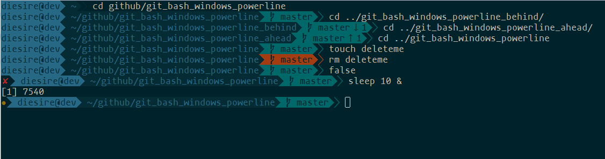
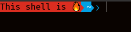

# Git bash for windows powerline theme

Light & simple powerline theme for Git bash for windows




## Install:

I recommend the following:

```bash
cd $HOME
mkdir -p .bash/git_bash_windows_powerline
git clone https://github.com/AaronJV/git_bash_windows_powerline.git .bash/git_bash_windows_powerline
```

then add the following to your .bashrc:

```bash
# Theme
THEME=$HOME/.bash/git_bash_windows_powerline/theme.bash
if [ -f $THEME ]; then
   . $THEME
fi
unset THEME
```

## Requisites

* In order for this theme to render correctly, you will need a
[Powerline-patched font](https://github.com/powerline/fonts).

## Extending
By updating POWERLINE_PROMPT before `. $THEME` in .bashrc, new segments can be added. The new segments are created via functions named `__powerline_<key>_prompt`.

The function should echo a string of the format `<text>|<color flags>`.
The color portion consists of 2 or 3 parts separated by spaces, `BG FG Modifier`

The color codes are as follows:
| Code | Color   | ANSI Code (BG/FG) |
| ---- | ------- | ------- |
| Bl   | Black   | 40 / 30 |
| R    | Red     | 41 / 31 |
| G    | Green   | 42 / 32 |
| Y    | Yellow  | 43 / 33 |
| B    | Blue    | 44 / 34 |
| M    | Magenta | 45 / 35 |
| C    | Cyan    | 46 / 36 |
| W    | White   | 47 / 37 |

And the modifiers:
| Code | Name | ANSI Code |
| ---- | ---- | --------- |
| B    | Bold | 1         |

<sup>* no modifier or any value not above is the reset escape code (0)</sup>

e.g.
```bash
# powerline-emoji.sh
function __powerline_emoji_prompt {
   local color="R Bl"
   echo "This shell is 🔥🔥🔥|$color"
}

# .bashrc
THEME=$HOME/.bash/git_bash_windows_powerline/theme.bash
if [ -f $THEME ]; then
   source powerline-emoji.sh
   POWERLINE_PROMPT="emoji cwd"
   . $THEME
fi
```

## License

MIT
